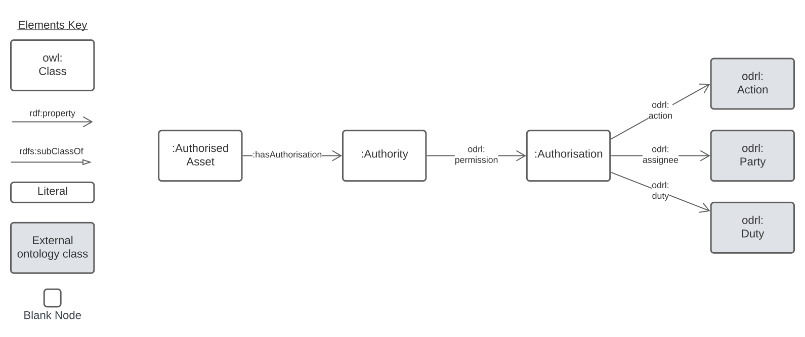

# authorisations-model

### v0.1.1

A model that describes the authorisation of agents to conduct activities

Code Repository at: <https://github.com/kurrawong/authorisations-model>

Published Online at: 

* <https://linked.data.gov.au/def/autho>

## Contacts

 * Nicholas Car <nick@kurrawong.ai>

## License & Rights

[Creative Commons BY 4.0](https://creativecommons.org/licenses/by/4.0/)

&copy; KurrawongAI, 2024