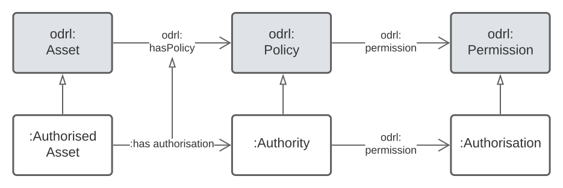

## Introduction 

1. [Purpose](#purpose)
2. [Basic Concepts](#basic)

### 1. Purpose

The purpose of this model is to represent "authorisations" by which is meant:

> "a Rule that grants Actions to an assignee Agent over an Authorised Asset"

This model is just a specialisation of the [Open Data Rights Language (ODRL)](https://www.w3.org/TR/odrl-model/) model, but it was though necessary to make this model, rather than to just point to ODRL for use, for while ODRL work perfectly well for the scenarios exemplified here (see BAsic Concepts for expected use below), ODRL's own examples are all oriented elsewhere - to the use of data objects.

This model aims to use names for elements and descriptions of them that are more intuitive within its target domains.

All the elements of this model are either ODRL model elements or have defined relationships to them.

  
_All classes and predicates of this model related to their_  
_more generalised superclasses and predicates in the ODRL model._

### 2. Basic Concepts

Typical use is expected to be modelling of permissions granting to people and companies for activities such as mining prospecting and the modelling of powers of government.

The things granting the authorisation are Authorities: laws, policies, regulations etc.

